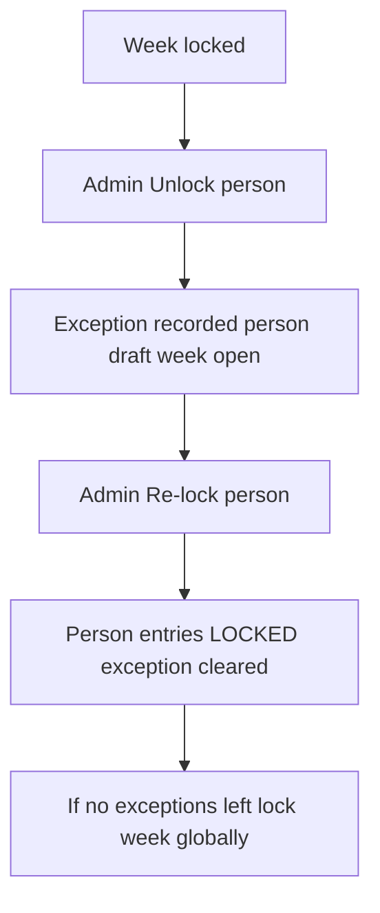

# Admin per-person Re-lock (exception model)

Add per-person unlock exceptions and an admin Re-lock action so clearing a person's exception (e.g. David Mead) can freeze their entries without requiring resubmit; when no exceptions remain, the global week lock is restored.

**Read first:** [WEEK_LOCK_MODEL.md](WEEK_LOCK_MODEL.md) — agreed meaning of global week lock, auto-lock, unlock, edit rules, and why **approve is lame**.

## Answers locked in

- **Model B:** Per-person unlock **exception**; Re-lock **cancels that person’s exception** (not a separate “approve”).
- **After unlock:** person is **draft** (submission + entries) — already true today via `unlock_timesheet` in `src/time_tracker_api/domain/weeks.py`.
- **Re-lock does not require submit** — admin may re-lock while still draft.
- **Edit rules:** week locked ⇒ nobody edits (including draft). Week open + draft ⇒ editable. See WEEK_LOCK_MODEL.
- **Approve** is **not** the way to “lock a user.” It wrongly closes the global week for everyone; candidate for removal. Prefer auto-lock + unlock/re-lock.

## Problem

Today `POST /timesheets/{personId}/unlock` drafts the person and **opens the global week**. There is no persisted “this person was unlocked,” and no admin re-lock route. Week detail only shows Unlock.

## Target behavior (week detail `/timesheets/2026-07-06`)

- **Unlock** (existing + extend): draft person; open week if locked; **create** `WeekUnlockException` for `(personId, weekStartDate)`.
- **Re-lock person** (new): delete exception; set that person’s entries to `LOCKED` (even if draft/unsubmitted); if **no exceptions remain** for the week, call `lock_week()`.
- **UI:** person with active exception shows amber **Unlocked** + **Re-lock**; confirm modal with week range; warn that if this is the last exception, the week re-locks for everyone; Cancel no-ops; refresh roster in place.
- **Out of this PR:** toast, optional reason/notes, full audit log (story AC leftovers). Removing or gutting approve is a follow-up (called out in WEEK_LOCK_MODEL).

## API (`time-tracker-api`)

1. **Persist exceptions** — new entity (or equivalent item) e.g. `WeekUnlockException` keyed by person + week Monday; domain helpers `add_unlock_exception` / `clear_unlock_exception` / `list_unlock_exceptions(week)`.
2. **Extend** `unlock_timesheet` — after current logic, write exception.
3. **New** `POST /api/v1/timesheets/{personId}/relock?weekStartDate=` — `AdminDep`; implement `relock_timesheet(...)` as above; return weekLock + person submission/entry summary.
4. **Extend roster** `list_week_roster` / `WeekRosterPersonRow` — add `unlockException: bool` (and optionally `unlockedAt` if cheap).
5. **Recovery for Dev (David already unlocked pre-exception):** also expose `POST /api/v1/timesheets/weeks/{weekStartDate}/lock` (`AdminDep`) → `lock_week` only, so an open week with no exception rows can still be re-locked globally. Week detail shows **Re-lock week** when `weekLock.status === open`.
6. Tests: unlock creates exception; relock clears it and locks week when last; relock without submit allowed; non-admin 403; roster flag.

## Frontend (`time-tracker-frontend-01`)

1. API client: `relockTimesheet`, `lockWeek`; roster type includes `unlockException`.
2. `AdminWeekDetailPage.tsx`:
   - Badge **Unlocked** when `unlockException`
   - **Re-lock** on exception rows (modal sibling of unlock)
   - Header **Re-lock week** when week is open (uses week lock endpoint)
3. Modal copy: week date range; last-exception ⇒ everyone read-only again.
4. Hook refresh after relock (same as unlock).
5. Update `docs/ADMIN_TIMESHEETS_SCREEN_PLAN.md`.

## CLI (`time-tracker-cli`)

1. `tt timesheets relock` → `POST /timesheets/{personId}/relock`
2. `tt timesheets lock-week` → `POST /timesheets/weeks/{weekStartDate}/lock`
3. Week roster pretty output: `UNLOCKED` column when `unlockException`

## Branches / PRs

- API: `cursor/admin-timesheet-relock-af11` → `develop`
- Frontend: `cursor/admin-timesheet-relock-ui-af11` → `develop`
- CLI: `cursor/admin-timesheet-relock-cli-af11` → `main`
- Ready for review; merge API first

## Note on story ACs

This delivers the operational path for “unlock David → correct → re-lock” under model B without submit. It does **not** yet fully satisfy toast / reason / Auto-locked-row-only Unlock ACs from the earlier story list.
