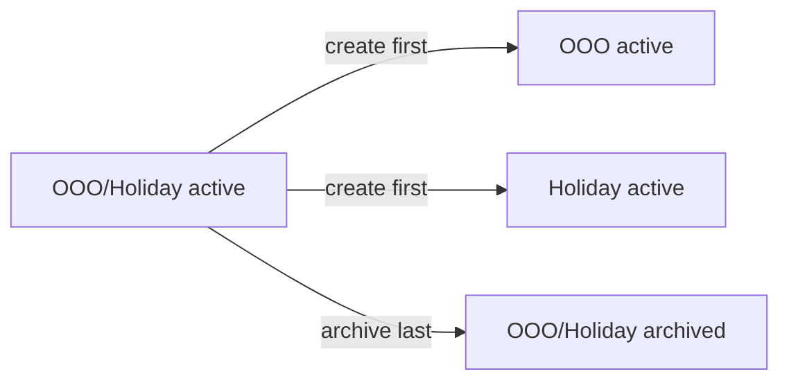

# OOO / Holiday project split (prod runbook)

Operational steps to replace the combined **OOO/Holiday** project with separate **OOO** and **Holiday** projects, then archive the old one.

**Locked decision:** forward-only — no migration of existing time entries. Historical rows stay on `OOO/Holiday`; new logging uses `OOO` or `Holiday`.

## Approach

- **Archive** = soft-delete (`status: archived`). Past entries remain on `OOO/Holiday`.
- **Create** `OOO` and `Holiday` first, verify, **then** archive `OOO/Holiday`.
- **CLI only** — all commands go through the API (`tt` → HTTP). See [ACTIONS.md](ACTIONS.md).



## Before you run

**1. Inspect the existing project** — copy real `billType`, dates, `accountId`, `allowedRoles`:

```cmd
tt projects get --profile prod --name "OOO/Holiday"
```

**2. Confirm role names** (must match company registry exactly):

```cmd
tt company-roles list --profile prod
```

Stub/import data used `N-BIL-I`, roles `AEM Architect, Cloud Architect, EA, PM`, dates `2026-04-01`–`2027-03-31`. **Use prod values from step 1.**

## Commands (prod)

Replace allowed roles and dates with values from `projects get`.

```cmd
REM 1) Verify current state
tt projects list --profile prod --status active
tt projects get --profile prod --name "OOO/Holiday"

REM 2) Create new projects (before archiving)
tt projects create --profile prod ^
  --name OOO ^
  --bill-type N-BIL-I ^
  --allowed-roles "AEM Architect,Cloud Architect,EA,PM" ^
  --start-date 2026-04-01 ^
  --end-date 2027-03-31

tt projects create --profile prod ^
  --name Holiday ^
  --bill-type N-BIL-I ^
  --allowed-roles "AEM Architect,Cloud Architect,EA,PM" ^
  --start-date 2026-04-01 ^
  --end-date 2027-03-31

REM 3) Verify
tt projects list --profile prod --status active
tt projects get --profile prod --code OOO
tt projects get --profile prod --code Holiday

REM 4) Archive combined project
tt projects archive --profile prod --name "OOO/Holiday" --confirm

REM 5) Confirm archived
tt projects list --profile prod --status archived
tt projects get --profile prod --name "OOO/Holiday"
```

Add `--account-id <UUID>` to both `create` commands if the existing project has one.

**Linux/macOS:** same flags; use `\` instead of `^` for line continuation.

## Gotchas

### Archive does not move entries

Past entries stay on `OOO/Holiday`. Entry update (CLI or API) cannot change `projectId` today — forward-only is fine.

### Name lookup

While `OOO/Holiday` is still active, `tt projects get --name OOO` may partial-match the combined name. Use `--code OOO` / `--code Holiday` or project UUID.

### Live timesheet UI

The **production React app** (`time-tracker-frontend-01`) loads projects from `GET /api/v1/projects?status=active` — after this split it will show **OOO** and **Holiday** automatically. No frontend deploy required for the picker.

The hardcoded `OOO/Holiday` string is only in the **static UI mockup** [`screen1_week_summary.html`](../../time-tracker-frontend-01/docs/ui/screen1_week_summary.html) (design prototype with fake `PROJS` array). Update that file if you still use the mock for demos.

## Verification

- [ ] Active list shows `OOO` and `Holiday`, not `OOO/Holiday`
- [ ] `OOO/Holiday` is `archived`
- [ ] New entry on `OOO` succeeds (open week):

```cmd
tt entries create --profile prod --email you@blvdinteractive.com ^
  --project-name OOO --work-date 2026-07-07 --role PM --hours 8
```

- [ ] New entry on archived `OOO/Holiday` fails (422)

## Optional follow-ups

| Task | Where |
|------|--------|
| Update import stub CSV | `time-tracker-api/scripts/import-projects.stub.csv` |
| Update UI mock project list | `time-tracker-frontend-01/docs/ui/screen1_week_summary.html` |
| Bulk entry migration | API + CLI feature (not needed for forward-only) |
