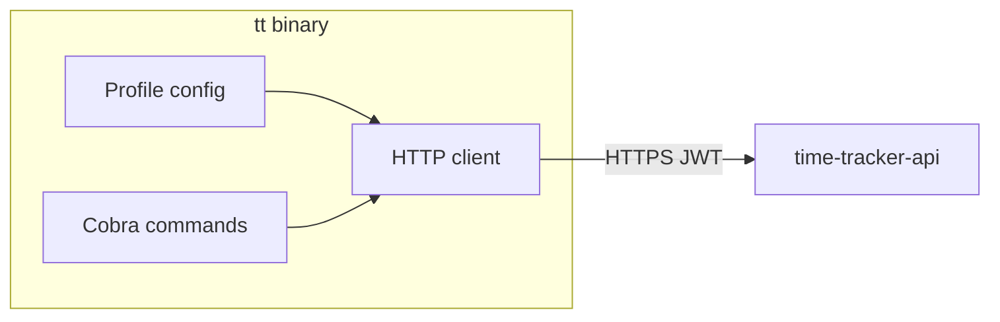

# time-tracker-cli (`tt`) — design and implementation plan

## Decisions

| Choice | Value |
|--------|--------|
| Executable | `tt` |
| Language | **Go** (native binary, Windows + Linux) |
| API scope | **Implemented endpoints only** (~70 routes in [time-tracker-api `IMPLEMENTED_ROUTES`](https://github.com/stage3technical/time-tracker-api/blob/main/src/time_tracker_api/routes/v1_stubs.py) plus `GET /timesheets/{person_id}`, `POST /persons/import`, `GET /health`, `GET /me`, `POST /items`) |
| Transport | HTTPS + `Authorization: Bearer <JWT>` |
| Repo | [`time-tracker-cli`](https://github.com/stage3technical/time-tracker-cli) |

## Architecture



- **No DynamoDB direct access** — all mutations go through the API (same as Bruno / `import_persons.py`).
- **Thin client**: build URL, attach bearer token, send JSON, print response, propagate exit codes.

## Config (AWS `configure` style)

**File locations** (created by `tt configure`):

| OS | Path |
|----|------|
| Linux/macOS/WSL | `~/.tt/config` |
| Windows | `%USERPROFILE%\.tt\config` |

**INI format** (human-editable, like AWS profiles):

```ini
[default]
profile = dev

[profile dev]
base_url = https://8igr6pspqh.execute-api.us-east-1.amazonaws.com
token = eyJhbGciOi...

[profile uat]
base_url = https://<uat-api-endpoint>
token = eyJhbGciOi...
```

**Resolution order** (first wins):

1. Flags: `--base-url`, `--token`
2. Env: `TT_API_BASE_URL`, `TT_API_TOKEN`, `TT_PROFILE`
3. Config file profile (`[default].profile` → `[profile <name>]`)

**Security**: write config with mode `0600` on Unix; document that tokens are secrets (never commit). Optional future: `token_command` (like `aws credential_process`).

## Global flags (all commands)

```
--profile string     config profile name (default from [default])
--base-url string    override API base URL
--token string       override JWT
--output string      json|pretty (default: pretty for TTY, json when piped)
--quiet              suppress non-essential stderr
```

## Command tree

### Core (Phase 1)

```
tt configure                          # interactive: profile name, base_url, token
tt configure list                     # show profiles (mask token)
tt configure set --profile NAME --base-url URL --token TOKEN

tt health                             # GET /health (no auth)
tt me                                 # GET /me

tt persons list [--status active] [--type W2]
tt persons get <id>
tt persons update <id> [--name] [--email] [--primary-role] [--employment-type] [--team]
tt persons import [--on-duplicate update|skip|fail] --file payload.json
tt persons manager get <id>
tt persons manager set <id> --manager-id <uuid>
tt persons subordinates list <id>

tt api <METHOD> <path> [--query key=value ...] [--body @file.json | --body '{}']
```

**Immediate use after build** (Nicholaus name/email fix):

```bash
tt configure set --profile dev --base-url https://8igr6pspqh.execute-api.us-east-1.amazonaws.com --token "$JWT"
tt persons update a091a3d5-f18a-4071-8ad0-454d9fe61cde --name "Nicholaus Chipping" --email nicholaus.chipping@blvdinteractive.com
tt persons manager get 96480ff9-fe32-482a-b553-fe46980b81bf
```

### Phase 2 — remaining implemented resources

Mirror API route groups from [time-tracker-api routes](https://github.com/stage3technical/time-tracker-api/tree/main/src/time_tracker_api/routes):

| Group | Commands | API prefix |
|-------|----------|------------|
| `persons` | create, deactivate, manager remove, subordinates add/remove | `/api/v1/persons` |
| `projects` | roles, manager, account-manager, approvers | `/api/v1/projects` |
| `accounts` | CRUD | `/api/v1/accounts` |
| `company-roles` | CRUD | `/api/v1/company-roles` |
| `entries` | list/get/create/update/delete + filters | `/api/v1/time-reporting/entries` |
| `timesheets` | week, submit, approve, reject, unlock, bulk-approve | `/api/v1/timesheets` |
| `documentation` | explanation CRUD | `/api/v1/documentation/explanation` |
| `relationships` | two-way / one-way CRUD | `/api/v1/employee-relationships` |
| `items` | create (scaffold) | `/items` |

**Shipped in Phase 2a:** `tt timesheets`, `tt entries`, `tt projects` (list/get/create/update/archive).

### Generic escape hatch (Phase 1)

For anything not yet wrapped:

```
tt api <METHOD> <path> [--query key=value ...] [--body @file.json | --body '{}']
```

Example: `tt api PUT /api/v1/persons/UUID/manager --body '{"managerId":"..."}'`

## Request/response behavior

- **JSON bodies**: create/update commands accept `--file payload.json` or field flags where practical.
- **Success**: print response body; exit `0`.
- **API errors**: print `{"detail":...}` to stderr; exit with HTTP status (404→4, 409→9, etc.) or `1` if unmapped.
- **204 No Content**: exit `0`, no body.
- **List output**: `pretty` mode uses tabwriter for key columns (`id`, `name`, `email`); full JSON available with `--output json`.

## Repo layout

```
time-tracker-cli/
  cmd/tt/main.go
  internal/
    config/config.go          # load/save ~/.tt/config, profile resolution
    client/client.go          # HTTP + auth + error parsing
    output/output.go          # json vs pretty
    cmd/
      root.go                 # global flags
      configure.go
      health.go
      persons.go
      api.go
  docs/CLI.md                 # full command reference
  docs/PLAN.md                # this document
  README.md
  go.mod
  .gitignore
  .github/workflows/ci.yml
```

**Dependencies**: `github.com/spf13/cobra`, `gopkg.in/ini.v1`, stdlib `net/http`.

## CI / distribution

- **CI** (`push` + `PR`): `go test ./...`, `go build ./cmd/tt` on `ubuntu-latest` and `windows-latest`.
- **Install (dev)**:
  - Linux/WSL: `go install ./cmd/tt` or download release binary
  - Windows: `go build -o tt.exe ./cmd/tt` or release `.exe`

## Out of scope (v1)

- v1 **stub** endpoints (calendar, billing, audit, etc.)
- OAuth device flow / token refresh (manual JWT paste for now)
- DynamoDB import scripts (keep `import_persons_dynamodb.py` in time-tracker-api for bulk)
- Shell completion (can add `tt completion bash|powershell` in v1.1)

## Implementation status

| Phase | Status |
|-------|--------|
| Phase 1 (configure, health, me, api, persons) | **Shipped** |
| Phase 2a (timesheets, entries, projects core CRUD) | **Shipped** |
| Phase 2b (persons create/deactivate, project roles, bulk-approve, accounts, …) | Planned |

## Risk note

JWT expires — CLI will return `401`; re-run `tt configure set ... --token` or set `TT_API_TOKEN`. Copy token from browser devtools (same as Bruno today).
