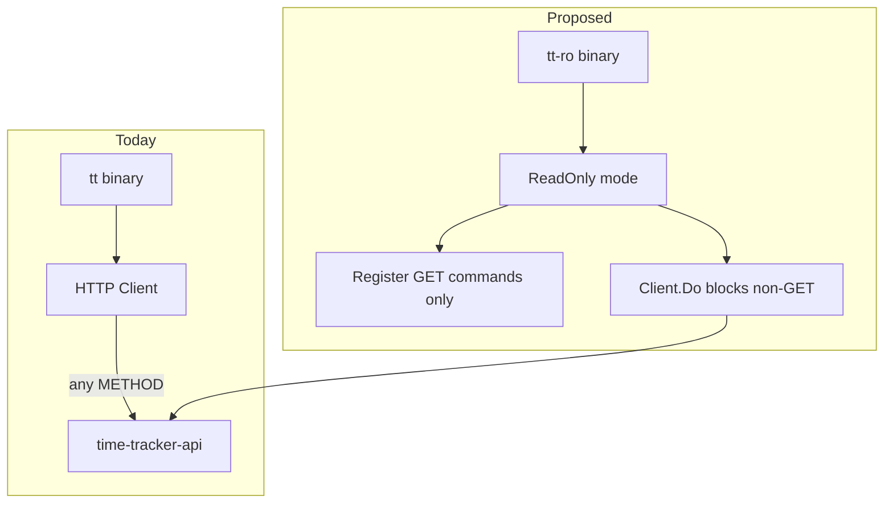

# Read-only CLI (`tt-ro`) plan

Add a second binary `tt-ro` in time-tracker-cli that shares the same Cobra command code as `tt` but only registers read commands and blocks non-GET HTTP at the client layer. CLI-only enforcement first; API read-only tokens/groups as a follow-up for real security.

## Locked decisions

1. **Delivery** — **Separate binary `tt-ro`** (`cmd/tt-ro/main.go`). No `tt --read-only` flag. **Build both `tt` and `tt-ro` on every build** (local scripts, CI, release).

2. **Enforcement** — **CLI only for now**. API read/write authorization is out of scope; document that `curl` or full `tt` can still mutate.

3. **Timesheet workflow** — **Strict read-only**: `timesheets list/get` and `entries list/get` only. No `submit`, `approve`, `reject`, `unlock`, or `purge`.

4. **`tt api`** — **Not included in `tt-ro` at all**. No generic API escape hatch; no flag to enable it.

5. **`configure`** — **Allowed** (`configure list`, `configure set`, interactive wizard). Local file only; does not call the API.

## Implementation todos

- [x] User confirms design choices (separate binary, CLI-only, strict workflow, no api, configure allowed)
- [x] Add `ModeFull` / `ModeReadOnly` to `internal/cmd` and `cmd/tt-ro/main.go` entrypoint
- [x] Tag all subcommands `CapRead` / `CapWrite` / `CapLocal`; register only read commands in `ModeReadOnly` (omit `api` entirely)
- [x] Add `ReadOnlyClient` wrapper blocking non-GET HTTP in `resolveClient`
- [x] Update build scripts, CI, and GitHub release to **always** ship `tt` and `tt-ro` together
- [x] Document allowlist in `CLI.md` / `README`; add unit tests for guard and command visibility

---

## Current state

- Single entrypoint: `cmd/tt/main.go` → `internal/cmd`
- HTTP layer: `internal/client/client.go` — `Do(method, path, ...)` has no method restrictions
- Generic writes: `internal/cmd/api.go` accepts any METHOD
- API: all `/api/v1/*` routes use `Depends(get_current_user)`; **no read/write authorization** on the server



---

## Recommended architecture

### 1. CLI mode in shared package

Add to `internal/cmd/root.go`:

```go
type Mode int
const (
    ModeFull Mode = iota
    ModeReadOnly
)

func Execute(mode Mode) error { ... }
```

- `cmd/tt/main.go` → `cmd.Execute(ModeFull)`
- `cmd/tt-ro/main.go` → `cmd.Execute(ModeReadOnly)` with root `Use: "tt-ro"` and updated Short/Long text

### 2. Command registration by capability

Introduce a small registry (e.g. `internal/cmd/capabilities.go`):

| Capability | Examples |
|------------|----------|
| `CapLocal` | `configure` (list/set) — no API |
| `CapRead` | `health`, `me`, `version`, `persons list/get`, `projects list/get`, `entries list/get`, `timesheets list/get/week/lastweek`, `company-roles list/get`, relationship GETs |
| `CapWrite` | everything else: create/update/delete/archive/import, workflow POSTs, `api` |

In `ModeReadOnly`:

- Register only `CapLocal` + `CapRead` subcommands (write commands **not in help tree** — `unknown command` UX)
- **Do not register `api`** — no escape hatch, no opt-in flag

Tag each subcommand in existing files (`persons.go`, `timesheets.go`, etc.) at registration time — single source of truth when Phase 2 commands land.

### 3. Defense in depth: HTTP client guard

Add `internal/client/readonly.go`:

```go
func (c *ReadOnlyClient) Do(method, path string, ...) {
    if method != http.MethodGet && path != "/health" {
        return nil, ErrReadOnly
    }
    return c.inner.Do(...)
}
```

Use in `resolveClient()` when `ModeReadOnly` — catches any missed write path or future command bugs.

### 4. Read-only command allowlist (initial)

**Include in `tt-ro`:**

| Group | Commands |
|-------|----------|
| Setup | `configure list`, `configure set`, `configure` (interactive) |
| Scaffold | `health`, `me`, `version` |
| Persons | `list`, `get`, `manager get`, `subordinates list` |
| Projects | `list`, `get` |
| Entries | `list`, `get` |
| Timesheets | `list`, `get` |
| Company roles | `list`, `get` |
| Accounts | `list`, `get` (when wrapped) |

**Exclude from `tt-ro`:**

- All mutating person/project/entry/role/account commands
- `timesheets submit|approve|reject|unlock|purge`
- `projects archive`
- **`tt api` entirely** (not registered)

### 5. Build, release, docs

- **Every build produces both binaries**: `tt` and `tt-ro` (Windows: `tt.exe` + `tt-ro.exe`)
- Update `scripts/build.sh` / `scripts/build.ps1` / `build.cmd` accordingly
- CI: `go build ./cmd/tt` **and** `go build ./cmd/tt-ro` on every run; tests for read-only guard
- GitHub release: attach both artifacts
- Docs: new section in `docs/CLI.md` — when to use `tt` vs `tt-ro`, explicit allowlist, note that API can still be written via curl/full `tt`
- README quick start for report/ops users

### 6. Tests

- `internal/client/readonly_test.go` — non-GET returns `ErrReadOnly` without network
- `internal/cmd/readonly_test.go` — `tt-ro` help does not list `purge`/`archive`; executing a write subcommand fails (if registered) or unknown command
- Integration-style: `Execute(ModeReadOnly)` + mock client or httptest

---

## Future: API enforcement (out of scope unless you want it now)

For tokens that **cannot** mutate even via curl:

- Parse `cognito:groups` from JWT in `time-tracker-api` `auth/dependencies.py`
- Add `require_admin` dependency on unlock/purge routes
- Optionally issue **read-only IAM/API scope** or separate Cognito app client for report automation

This is a separate PR in `time-tracker-api`; `tt-ro` should document the dependency.

---

## Files to touch (time-tracker-cli)

| File | Change |
|------|--------|
| `cmd/tt-ro/main.go` | New entrypoint |
| `cmd/tt/main.go` | Pass `ModeFull` |
| `internal/cmd/root.go` | `Execute(mode)`, conditional command tree |
| `internal/cmd/*.go` | Capability tags per subcommand |
| `internal/client/readonly.go` | HTTP method guard |
| `scripts/build.*` | Build both binaries |
| `.github/workflows/ci.yml` | Build + test both |
| `docs/CLI.md`, `README.md` | User-facing docs |

---

## Risks / tradeoffs

| Risk | Mitigation |
|------|------------|
| CLI-only is bypassable | Document clearly; plan API enforcement |
| Drift when new write commands added | Capability tags + client guard + CI test that scans for untagged commands |
| Two binaries to distribute | Single build script always outputs both; release ships `tt` + `tt-ro` |
